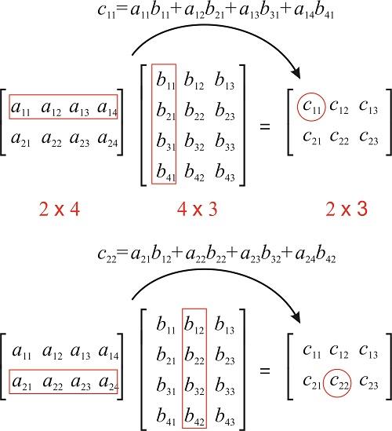
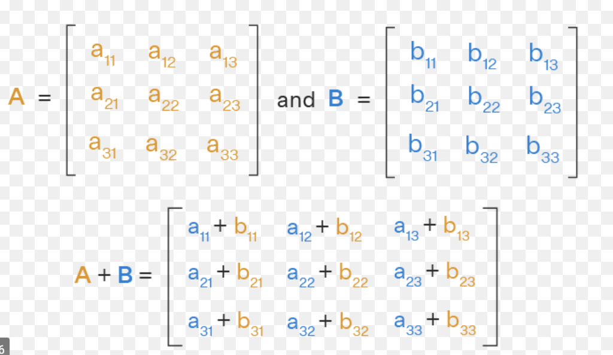
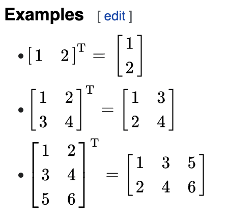

# Matrix Operations

## Instructions

You have to implement the class **Matrix** and add all the following methods

### Multiplication

Given 2 Matrix compute the multiplication of them and return the result as another Matrix.

If **A** has dimensions **m × n** and **B** has dimensions **n x p**.

Then the product **C = A x B** has dimensions **m x p**.

Where C<sub>i,j</sub> = Sum of each element of the row A<sub>i</sub> by each element of the column B<sub>j</sub>. [See](https://en.wikipedia.org/wiki/Matrix_multiplication)



For example:

```python

a = Matrix([[1, 2, 3], [4, 5, 6]])
b = Matrix([[1, 2], [3, 4], [5, 6]])
a * b
```

Should return:

```python
Matrix([[22, 28],
        [49, 64]])
```

Also we want to implement in the same method scalar multiplication

```python

a = Matrix([[1, 2, 3], [4, 5, 6]])
b = 2
a * b
```

Should return:

```python
Matrix([[2, 4, 6], [8, 10, 12]])
```

### Add

Given 2 Matrix compute the sum of them and return the result as another Matrix. Raise an exception when dimension doesn't match. [See](https://en.wikipedia.org/wiki/Matrix_addition)



For example:

```python

a = Matrix([[1, 2], [4, 5]])
b = Matrix([[1, 2], [3, 4]])
a + b
```

Should return:

```python
Matrix([[2, 4],
        [7, 9]])
```

Raise an exception if argument that is multiplying the matrix isn't another Matrix or a int.

### Transpose

Given a Matrix compute the transpose of it and return the result as another Matrix. [See](https://en.wikipedia.org/wiki/Transpose)



For example:

```python

a = Matrix([[6, 4, 24],
            [1, -9, 8]])
~a
```

Should return:

```python
Matrix([[6, 1],
        [4, -9],
        [24, 8]])
```

## Instructions

* [Python Magic methods](https://python-course.eu/oop/magic-methods.php) 
